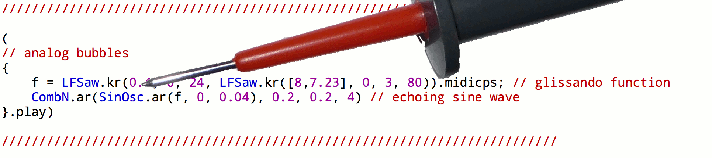

# A Code Bending Library
(SuperCollider Quark)

Code bending is, analogous to circuit bending, a way to reuse the internal wiring of a signal flow. This library  allows for interaction with signal graphs directly, without inserting explicit parameters or GUI elements in the code. Any number and any output of a ugen can be bent.

