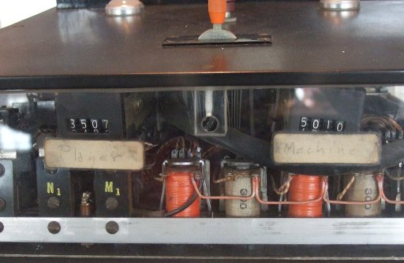

# MindReadingMachine
A SuperCollider implementation of Claude Shannon's 'Mind-Reading (?) Machine' from 1953

This machine that plays the "odds and evens" game with some external agent is inspired by game theory and American Romantic literature has had a wide reception in psychoanalysis and media theory by way of Jacques Lacan.

Its musical application allows to reinterpret a zero sum game as a non zero sum call and response pattern.

(SuperCollider Quark)

