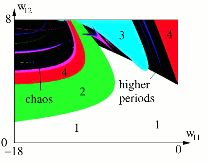

# Neuromodule
Neuromodules are a model for experimenting with the temporal dynamics of time-discrete neural networks, following ````Frank Pasemann, Complex dynamics and the structure of small neural networks, Network: Comput. Neural Syst. 13, 2002, pp. 195--216````.


"The widespread recurrent structures found in biological neural networks imply the possibility of complex neural dynamics and, in fact, oscillatory and chaotic activity has been observed frequently in brains. This suggests that complex dynamics may play an important role for specific functions of the brain. Therefore, these dynamical properties have found increasing attention in recent years; but it still remains an open question to what extent and through which kind of mechanisms oscillatory and chaotic dynamics can contribute to effective signal processing in the brain." (p. 195f.)



This iso-periodic diagram shows the "metric landscape" of a 2-module (numbers denoting the cycle length). The plot is in the (w11,w12)-subspace for fixed parameters w21 = −6, θ1 = −3, θ2 = 4. (image from Pasemann 2002, p. 201).


