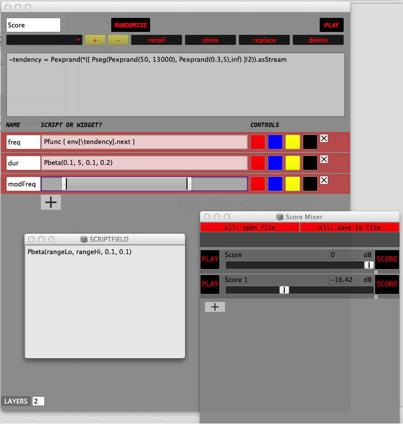

**caAC-MLib 0.42**
---
**Computer Aided Algorithmic Composition Library 0.42**
---

 
A library with various SuperCollider classes and UGens extensions to perform algorithmic composition and digital sound synthesis, according to concepts and approaches towards flexible models and user interfaces. The most important aspect is the development of a flexible UI frontend progammed in SuperCollider, that works with patterns and tactile controllers, such as the Lemur app, in a model-view-controller paradigm, in order to achieve bi-directional control between SuperCollider and the Lemur applications, and furthermore to perform realtime CAAC and digital sound synthesis.    

**Contents:**
---
 
- Various GUI elements  
- Various (Demand) UGens  
- Various Pattern classes   
- MLemurGui  
- Score & Controller interface (prototype) 
- PresetInterface (prototype) 

**Example code:**  
---
    
    /*Add 30 faders to the Lemur interface:*/
    
    ~lm = MLemurGui.new; 
     
    ~lm.connect("192.10.1.2",8002,8000);    

    ~lm.set_osctarget(0,"192.10.1.16", NetAddr.langPort);   
    ~lm.resetAll;
    
    30 do: {|i|~lm.fader("klang",\sine++i,i%15*65+25,asInt(i/15%2,1)*350,65,350,Color.rand)};
    30 do: {|i|~lm.oscaddr.sendMsg('/sine'++i++'/x',1.0.linrand)}; 
 
    OSCFunc.trace(true);

    30 do: {|i|~lm.removeFader("klang",\sine++i)}; 

    ~lm.disconnect;
    ~lm.removeSwitches;

**The Score & Controller Interface:**
---
An important tool in this library is a flexible interface: the Score & Controller Interface to embed script-based composition into an OSC-controller setup. This interface is going to be released in September. A prototype can be found here. 

[This is the link to a crappy video demonstration of the prototype version on Vimeo.](https://vimeo.com/68702753/) 

**Status**
---
This library is currently under active development. 

**Contact**
---

Marinus Klaassen  
marinus_klaassen@hotmail.com 

[www.soundcloud.com/marinusklaassen](www.soundcloud.com/marinusklaassen)  
[www.rotterdamruis.nl](www.rotterdamruis.nl)

